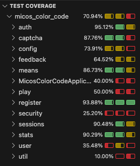

# MICOS COLOR CODE

MICOS es una web (mobile-first) dirigida a niños y niñas de entre 3 y 8 años con daltonismo dicromático. Surge tras la creación del sistema visual "Micos color code", pensado para facilitar la identificación de los colores por parte de los peques con esta alteración visual. 

Con la web se pretende que mediante una forma lúdica, visual y sencilla, continúen con el aprendizaje también a través de las pantallas. 

[Aquí encontrarás la documentación del proyecto ↗︎](https://www.notion.so/sara-vazquez/MICOS-PROYECTO-FINAL-23fd5565c5b68048a775fc74e9a9f749)
[En este enlace podrás acceder a la presentación ↗︎](https://www.figma.com/slides/50blXM7DC2VcG9xuHCyYiL/micos-color-code-slides?node-id=1-614&t=jnPYgwghxAS1wwKQ-1)


## 📓 Diagrama de clases UML


## 📙 Diagrama entidad-relación


## 🚀 Instalación y ejecución
1. Haz fork del repositorio

2. Crea una rama para tu feature/fix
	 ```
	 git checkout -b feature/nueva-funcionalidad
	 ```

3. Configura la base de datos MySQL (ver `application.properties`)
   
- [Consulta la guía con las instalaciones que necesitas ↗︎](https://www.notion.so/sara-vazquez/Instalaciones-back-28dd5565c5b6805e823dc9f9ec5170d9)

4. Haz tus cambios y crea un pull request
 	 ```
	 git commit -m "Descripción breve del cambio"
	 git push origin feature/nueva-funcionalidad
	 ```

5. Levanta los servicios con Docker Compose:
	 ```
	 docker compose up -d
	 ```

6. Ejecuta la aplicación Spring Boot:
	 ```
	 mvn spring-boot:run
	 ```

  La aplicación se levantará en:
👉 http://localhost:8080


## 🔗 Endpoints principales

1. 🔐 **AUTENTICACIÓN**

	- POST http://localhost:8080/auth/login - Login (USER, ADMIN)
	- POST http://localhost:8080/auth/logout - Logout (USER, ADMIN)
	- POST http://localhost:8080/register - Registration (First user registered: role ADMIN)
	- GET http://localhost:8080/captcha/generate - Generate captcha - register (USER, ADMIN)

2. 📚 **RECURSOS**

	- GET http://localhost:8080/admin/resources - Get all resources (ADMIN)
	- GET http://localhost:8080/users/resources - Get all resources (USER)
	- POST http://localhost:8080/admin/resources  - Add new resources (ADMIN)
	- PUT http://localhost:8080/admin/resources/{id} - Update a resource (ADMIN)
	- DEL http://localhost:8080/admin/resources/{id} - Delete a resource (ADMIN)

3. 📄 **FEEDBACK**

	- POST http://localhost:8080/feedback - Create feedback - email service (USER)

4. 🎮 **JUEGOS**

	- POST http://localhost:8080/users/play/{gameId}/sessions - Create game session (USER)
	- GET http://localhost:8080/users/play/{gameId}/ranking - Get game ranking chart (USER)


## 📯 Pruebas en Postman
[Aquí encontrarás la colección de Postman con todas las pruebas realizadas y documentadas](https://lunar-rocket-4378638.postman.co/workspace/Micos-Color-Code~285e65ce-5ab6-47e7-b8b9-561f4583a023/collection/45994293-ef366550-d042-46ab-985c-3a5388e09d83?action=share&creator=45994293)

## 📋 Funcionalidades principales del ADMIN
### Gestión de recursos:
  - Listar 📄
  - Añadir ➕
  - Editar ✏️
  - Eliminar 🗑

## 🧪 Test coverage y estructura

<details>
    <summary>📂 Estructura de carpetas</summary>

```
├── mvn
├── src
│   ├── main
│   │   ├── java
│   │   │   └── dev
│   │   │       └── sara
│   │   │          └── micos_color_code	
│	│   │              ├── auth
│	│   │              │  ├── AuthController.java
│	│   │              │  ├── AuthRequestDto.java
│	│   │              │  ├── AppointmentResponseDTO.java
│	│   │              │  ├── AuthResponseDTO.java
│	│   │              │  ├── AuthService.java
│	│   │              │  └── AuthServiceImpl.java
│	│   │              ├──captcha
│	│   │     		   │	├── CaptchaController.java
│	│   │              │  	└── CaptchaService.java
│	│   │              ├──config
│	│   │     		   │	├── CorsConfig.java
│	│   │     		   │	├── RepeatableContentCatchingRequestWrapper.java
│	│   │     		   │	├── RequestLogginFilter.java
│	│   │     		   │	├── SecurityConfig.java
│	│   │              │  	└── WebConfig.java
│	│   │              ├──feedback
│	│   │     		   │	├── FeedbackController.java
│	│   │     		   │	├── FeedbackRequestDTO.java
│	│   │              │  	└── FeedbackService.java
│	│   │              ├──means
│	│   │              │   ├── AdminResourceController.java
│	│   │              │   ├── AdminResourceService.java
│	│   │              │   ├── ResourceController.java
│	│   │              │   ├── ResourceDetailsResponseDTO.java
│	│   │              │   ├── ResourceEntity.java
│	│   │              │   ├── ResourceItemResponseDTO.java
│	│   │              │   ├── ResourceMapper.java
│	│   │              │   ├── ResourceNotFoundException.java
│	│   │              │   ├── ResourceRepository.java
│	│   │              │   ├── ResourceRequestDTO.java
│	│   │              │   └── ResourceService.java
│	│   │              ├── play
│	│   │              │   ├── GameEntity.java
│	│   │              │   ├── GameNotFoundException.java
│	│   │              │   └── GameRepository.java
│	│   │              ├── role
│	│   │              │   ├── RoleEntity.java
│	│   │              │   └── RoleRepository.java
│	│   │              ├── security
│	│   │              │   ├── CustomUserDetails.java
│	│   │              │   ├── CustomUserDetailsService.java
│	│   │              │   ├── JwtService.java
│	│   │              │   ├── SecurityUtils.java
│	│   │              │   └── UnauthorizedException.java
│	│   │              ├── sessions
│	│   │              │   ├── GameSessionController.java
│	│   │              │   ├── GameSessionEntity.java
│	│   │              │   ├── GameSessionRepository.java
│	│   │              │   ├── GameSessionRequestDTO.java
│	│   │              │   ├── GameSessionResponseDTO.java
│	│   │              │   └── GameSessionService.java
│	│   │              ├── stats
│	│   │              │   ├── RankingPlayerDTO.java
│	│   │              │   ├── RankingResponseDTO.java
│	│   │              │   ├── UserGameStatsController.java
│	│   │              │   ├── UserGameStatsEntity.java
│	│   │              │   ├── UserGameStatsRepository.java
│	│   │              │   └── UserGameStatsService.java
│	│   │              ├── user
│	│   │              │   ├── UserController.java
│	│   │              │   ├── UserEntity.java
│	│   │              │   ├── UserMapper.java
│	│   │              │   ├── UserRepository.java
│	│   │              │   ├── UserRequestDTO.java
│	│   │              │   ├── UserResponseDTO.java
│	│   │              │   ├── UserUpdateDTO.java
│	│   │              │   └── UserService.java
│	│   │              ├── util
│	│   │              │   ├── ApiMessageDTO.java
│	│   │              │   ├── EmailService.java
│	│   │              │   └── EmailServiceImpl.java
│	│   │              └── MicosColorCodeApplication.java
│   │   └── resources
│   │       ├── static
│   │       ├── templates
│   │       │   └── confirmation-email.html
│   │       ├── application-devmysql.properties
│   │       ├── application.properties
│   │       └── data.sql
│   │
│   └── test
│       └── java
│           └── dev
│               └── sara
│					└── micos_color_code
│	                   ├── integration
│	                   │  ├── AdminResourceControllerIntegrationTest.java
│	                   │  ├── RegisterControllerIntegrationTest.java
│	                   │  └── ResourceControllerIntegrationTest.java
│	                   ├── unit
│	                   │  ├── AdminResourceServiceTest.java
│	                   │  ├── AuthServiceImplTest.java
│	                   │  ├── CaptchaServiceTest.java
│	                   │  ├── FeedbackServiceTest.java
│	                   │  ├── GameSessionServiceTest.java
│	                   │  ├── JwtServiceTest.java
│	                   │  ├── RegisterServiceImplTest.java
│	                   │  ├── ResourceServiceTest.java
│	                   │  ├── UserEntityTest.java
│	                   │  ├── UserGameStatsEntityTest.java
│	                   │  ├── UserGameStatsServiceTest.java
│	                   │  ├── UserMapperTest.java
│	                   │  └── UserServiceTest.java
│	                   ├── MicosColorCodeApplicationTest.java
│	                   ├── TestcontainersConfiguration.java
│	                   ├── TestMicosColorCodeApplication.java
│					   └──resources
│ 					   	  ├── uploads
│  					   	  │    ├── images
│					   	  │    └── pdfs
│ 					   	  └── application-test.properties
│
│
│                   
├── uploads
│ 	├── images
│ 	└── pdfs
├── .env
├── .gitattributes
├── .gitignore
├── compose.yaml
├── mvnw
├── mvnw.cmd
├── pom.xml
└── README.md
```
</details>

### Autora
Sara Vázquez
